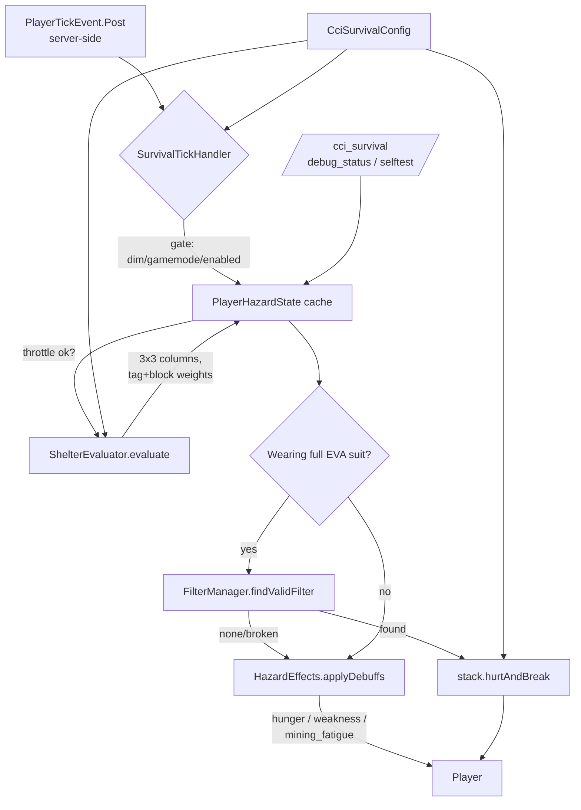

# Requirements

### Overview & Goals
Introdurre nel modpack **Create Colonial Industry** una nuova mod `cci_survival` (NeoForge 1.21.1 / Java 21) che aggiunge un loop survival ambientale leggero: la superficie dell'Overworld è ostile, il giocatore deve mettersi al riparo (shelter) o indossare una **Colonial EVA Suit** alimentata da **Air Filter Cartridge** consumabili. Niente eventi atmosferici, niente terraforming, niente integrazione con altre mod CCI o JourneyMap.

### Scope
**In Scope (MVP v0.1):**
- Registrazione di 4 pezzi di armor EVA + 1 cartuccia filtro.
- Valutazione *shelter* throttled (ogni N tick per player) con scoring per pesi materiale via tag/lista esplicita.
- Logica hazard (debuff leggeri) limitata all'Overworld, server-side.
- Consumo filtro condizionato a esposizione + indossamento full suit.
- Config NeoForge (`ModConfig.Type.COMMON`) per drain multipliers, intervalli, soglie shelter.
- Comandi OP-only `/cci_survival debug_status` e `/cci_survival selftest`.
- Dipendenza **required** da `cci_core` (compile + runtime locale via libs/, dichiarato nel `neoforge.mods.toml`).

**Out of Scope (esplicitamente rimandato):**
- Eventi atmosferici, biomi contaminati, stabilizzatori, terraforming, radiazioni.
- Integrazione con MineColonies, The Hordes, JourneyMap, cci_world, cci_scanner, cci_radar.
- GUI custom, modelli 3D custom, texture finali.
- Mixin, reflection, scansioni heavy ogni tick, force-loading di chunk.
- DataComponent custom per la carica filtro (rimandato a v0.2).

### User Stories
- **Come player survival** sulla superficie dell'Overworld senza protezione, ricevo debuff leggeri (hunger/weakness/mining_fatigue) finché non mi rifugio o equipaggio la tuta.
- **Come player survival** che indossa la tuta EVA completa con un filtro carico, posso restare esposto senza debuff a costo di consumare lentamente la durability del filtro.
- **Come player survival** in un rifugio adeguato (sottoterra o sotto materiali pesanti), non subisco debuff né consumo filtro.
- **Come player creative/spectator**, non vengo mai considerato a rischio.
- **Come operatore del server**, posso eseguire `/cci_survival debug_status` per ispezionare lo stato di un player e `/cci_survival selftest` per verificare che la mod sia caricata correttamente.

### Functional Requirements
1. **Hazard Gating**: hazard attivo solo se `surface_hazard_enabled=true`, dimension corrisponde a `hazard_dimension` (default `minecraft:overworld`), e player non è creative/spectator.
2. **Shelter Evaluation**: ogni `shelter_check_interval_ticks` (default 80) per player; valuta colonna 3×3 sopra la testa fino a `shelter_scan_depth` (default 12); somma pesi → stato `EXPOSED` / `PARTIAL` / `SAFE` con soglie `partial=3.0`, `safe=7.0`. Risultato cached in `PlayerHazardState` finché non cambia chunk o ci si sposta di >8 blocchi.
3. **Filter Drain**: solo quando il player è esposto/parziale e indossa full suit (se `require_full_suit=true`); moltiplicatori `exposed=1.0`, `partial=0.35`, `safe=0.0`. La carica è la **durability vanilla** dell'item: quando arriva al massimo damage, lo stack si rompe e la suit smette di proteggere.
4. **Debuff Application**: ogni `debuff_interval_ticks` (default 100), se hazard attivo + esposto + non protetto → applica `MobEffects.HUNGER`, `MobEffects.WEAKNESS`, e mining-fatigue (amplifier 0, durata breve ~ debuff_interval+padding). NIENTE nausea/blindness/poison/danno diretto in v0.1.
5. **Commands** (OP-only, permission level 2):
   - `/cci_survival debug_status [player]` → output strutturato di tutti i campi richiesti dall'issue.
   - `/cci_survival selftest` → verifica config caricata, item registrati, shelter evaluator su 3 casi sintetici (full-air, full-stone, mixed), gestione creative/spectator; non altera mondo né consuma filtri reali.
6. **No-Op Conditions**: niente lavoro lato client, niente force-load di chunk (skip silenzioso su posizioni non caricate).

### Non-Functional Requirements
- **Performance**: scan shelter eseguito al massimo ogni 80 tick per player; max 9 colonne × 12 blocchi = 108 `getBlockState` per check (solo su chunk già caricati).
- **Compatibility**: NeoForge 1.21.1 (`neo_version=21.1.228`), Java 21, no mixin, no AT.
- **Configurability**: drain multipliers, intervalli, soglie e profondità scan esposti via `ModConfigSpec`. La capacità del filtro è **fissata a registrazione** (12000 di durability) — modifiche richiedono nuova item registration / restart.
- **Logging**: `INFO` solo a startup, debug dettagliato esclusivamente via comando.

# Technical Design

### Current Implementation
Il repo è un template NeoForge `moddev` 2.0.141 vergine:
- `src/main/java/com/ccisurvival/ccisurvival.java` — classe `@Mod("cci_survival")` con esempio block/item/tab.
- `src/main/java/com/ccisurvival/ccisurvivalClient.java` — entrypoint client.
- `src/main/java/com/ccisurvival/Config.java` — `ModConfigSpec` con magic number/items.
- `src/main/templates/META-INF/neoforge.mods.toml` — dichiara solo `neoforge` + `minecraft`.
- `libs/cci_core-1.0.0.jar` presente ma **non** referenziato da `build.gradle`.

Va pulito e ristrutturato secondo i package richiesti dall'issue.

### Key Decisions
1. **Filter charge = vanilla durability fissa**. 
   - Rationale: in NeoForge 1.21.1 la via più semplice e stabile è `Item.Properties().durability(12000).stacksTo(1)` + `stack.hurtAndBreak(amount, serverLevel, serverPlayer, item -> {})`. Niente codec, niente network sync, niente registry custom.
   - **Limite documentato**: la max durability è fissata al momento della registrazione dell'item; cambiare `filter_capacity_ticks` in config richiede rebuild/restart e affetta solo i nuovi item creati. DataComponent dinamico è rimandato a v0.2.
2. **`cci_core` required, side=BOTH, ordering=AFTER**, dichiarato nel `neoforge.mods.toml`. In Gradle: `compileOnly files('libs/cci_core-1.0.0.jar')` + `runtimeOnly files('libs/cci_core-1.0.0.jar')` (no `flatDir`, metodo a singolo file usato nel template).
3. **Armor = `ArmorItem` con `ArmorMaterial` registrato via `DeferredRegister<ArmorMaterial>`** sul registry `Registries.ARMOR_MATERIAL`. Se la build segnala API issue, fallback a un `ArmorMaterial` vanilla (`ArmorMaterials.IRON.value()` o equivalente Holder) per non bloccare l'MVP. Texture/modello placeholder.
4. **Tick driver = `PlayerTickEvent.Post` server-side**. Throttling per-player nel `PlayerHazardState`. Niente `ServerTickEvent` globale.
5. **Stato per player = `ConcurrentHashMap<UUID, PlayerHazardState>`** in memoria, popolata lazily, ripulita su `PlayerEvent.PlayerLoggedOutEvent`. Nessuna persistenza.
6. **Shelter weights = ordine deterministico di check**: prima `BlockTags` verificati in 1.21.1, poi liste esplicite di `Blocks` per categorie senza tag affidabile, poi fallback `shelter_unknown_block_weight`.
   - Tag verificati 1.21.1: `BlockTags.LEAVES`, `BlockTags.LOGS`, `BlockTags.PLANKS`, `BlockTags.DIRT`, `BlockTags.SAND`.
   - Liste esplicite (Blocks.*): stone/cobblestone/deepslate/tuff (1.0); bricks/concrete/concrete_powder colors (1.5); iron_block/copper_block/netherite_block/gold_block (2.0); gravel (0.5); glass + stained glass (0.4).
7. **Hazard dimension match** = parsing `ResourceLocation` da config string vs `level.dimension().location()`.
8. **MobEffect mining fatigue**: in Mojmap 1.21.1 il campo è `MobEffects.DIG_SLOWDOWN` (Holder<MobEffect>). Verificheremo a build time; fallback `BuiltInRegistries.MOB_EFFECT.get(ResourceLocation.parse("minecraft:mining_fatigue"))` se necessario.

### Proposed Changes
**A. Build & metadata**
- `build.gradle` → in `dependencies`: `compileOnly files('libs/cci_core-1.0.0.jar')` + `runtimeOnly files('libs/cci_core-1.0.0.jar')`.
- `neoforge.mods.toml` → aggiornare `description`; aggiungere blocco `[[dependencies.${mod_id}]]` per `cci_core` con `type="required"`, `versionRange="[1.0.0,)"`, `ordering="AFTER"`, `side="BOTH"`.

**B. Refactor entrypoint**
Rinominare `com.ccisurvival.ccisurvival` → `com.ccisurvival.CciSurvival`. Spostare la registrazione in classi dedicate. Rimuovere `Config.java` placeholder ed esempio block/item/tab.

**C. Nuovi package e classi**
```
com.ccisurvival
 ├── CciSurvival                 (@Mod entrypoint)
 ├── CciSurvivalClient           (client entrypoint, minimal)
 ├── config
 │    └── CciSurvivalConfig      (ModConfigSpec)
 ├── item
 │    ├── CciSurvivalItems       (DeferredRegister.Items + ArmorMaterial)
 │    └── AirFilterCartridgeItem (Item con durability fissa)
 ├── shelter
 │    ├── ShelterState           (enum EXPOSED, PARTIAL, SAFE)
 │    ├── ShelterResult          (record)
 │    ├── ShelterWeights         (mappa tag/Block → weight)
 │    └── ShelterEvaluator       (scan 3x3xdepth, throttle gestito dal caller)
 ├── hazard
 │    ├── SurvivalTickHandler    (@EventBusSubscriber, PlayerTickEvent.Post)
 │    ├── HazardEffects          (applica MobEffectInstance)
 │    └── FilterManager          (cerca cartuccia, decrementa damage)
 ├── player
 │    └── PlayerHazardState      (cache per-player)
 └── command
      └── CciSurvivalCommands    (RegisterCommandsEvent)
```

**D. Flusso di tick (PlayerTickEvent.Post server-side)**
```
if (!surface_hazard_enabled) return;
if (!(player instanceof ServerPlayer sp)) return;
if (!sp.serverLevel().dimension().location().equals(hazardDim)) return;
if (sp.isCreative() || sp.isSpectator()) return;

state = STATES.computeIfAbsent(uuid, …);
tick = sp.server.getTickCount();

// 1) Re-evaluate shelter if needed
if (tick - state.lastShelterTick >= shelter_check_interval_ticks
 chunkChanged(state, sp) || movedFar(state, sp, 8)) {
    state.shelter = ShelterEvaluator.evaluate(sp);
    state.lastShelterTick = tick;
    state.lastEvalPos = sp.blockPosition();
    state.lastEvalChunk = sp.chunkPosition();
}

// 2) Decide protection
fullSuit = isWearingFullEvaSuit(sp);
filterStack = FilterManager.findValidFilter(sp); // null if none/empty
protected = fullSuit && filterStack != null;

// 3) Effects every debuff_interval_ticks
if (tick - state.lastEffectTick >= debuff_interval_ticks) {
    state.lastEffectTick = tick;
    multiplier = drainMultiplierFor(state.shelter.state());
    if (protected && multiplier > 0) {
        FilterManager.consume(filterStack, sp, (int)Math.ceil(debuff_interval_ticks * multiplier));
    } else if (!protected && state.shelter.state() == EXPOSED) {
        HazardEffects.applyDebuffs(sp, debuff_interval_ticks + 20);
    }
}
```

**E. ShelterEvaluator.evaluate**
```
int depth = config.shelter_scan_depth;
ServerLevel level = sp.serverLevel();
BlockPos head = sp.blockPosition().above(); // y of head
BlockPos.MutableBlockPos m = new BlockPos.MutableBlockPos();
double score = 0; int samples = 0;
for (int dx=-1; dx<=1; dx++)
  for (int dz=-1; dz<=1; dz++)
    for (int dy=1; dy<=depth; dy++) {
        m.set(head.getX()+dx, head.getY()+dy, head.getZ()+dz);
        if (!level.hasChunkAt(m)) continue; // never force-load
        BlockState s = level.getBlockState(m);
        score += ShelterWeights.weightFor(s);
        samples++;
    }
state = score >= safe_threshold ? SAFE
      : score >= partial_threshold ? PARTIAL
      : EXPOSED;
return new ShelterResult(state, score, samples, tick);
```

**F. ShelterWeights.weightFor(BlockState s)** — ordine deterministico:
```
if (s.isAir()) return 0;
if (s.is(BlockTags.LEAVES)) return 0.2;
if (s.is(Blocks.GLASS) || matchesAny(s, GLASS_PANES_AND_STAINED)) return 0.4;
if (s.is(BlockTags.SAND) || s.is(BlockTags.DIRT) || s.is(Blocks.GRAVEL)) return 0.5;
if (s.is(BlockTags.PLANKS) || s.is(BlockTags.LOGS)) return 0.7;
if (matchesAny(s, STONE_LIKE)) return 1.0;     // stone, cobblestone, deepslate, tuff, andesite, granite, diorite, blackstone
if (matchesAny(s, BRICKS_LIKE)) return 1.5;    // bricks, stone_bricks, deepslate_bricks, concrete colors
if (matchesAny(s, METAL_BLOCKS)) return 2.0;   // iron_block, copper_block, netherite_block, gold_block
return config.shelter_unknown_block_weight;
```

**G. FilterManager**
```
findValidFilter(Player p):
    for stack in mainInventory + offhand:
        if (stack.is(CciSurvivalItems.AIR_FILTER_CARTRIDGE.get())
            && stack.getDamageValue() < stack.getMaxDamage())
            return stack;
    return null;

consume(ItemStack s, ServerPlayer sp, int amount):
    s.hurtAndBreak(amount, sp.serverLevel(), sp, item -> {});
```

**H. Commands (Brigadier, permission level 2)**
- `/cci_survival debug_status [player]` → 11 righe testo come da issue.
- `/cci_survival selftest` → assert config, registry, weight su `Blocks.AIR/STONE/OAK_PLANKS`, simulazione weight-array per 3 stati, gating creative/spectator. Nessuna mutazione mondo/inventario.

### Data Models / Contracts
```java
public enum ShelterState { EXPOSED, PARTIAL, SAFE }

public record ShelterResult(ShelterState state, double score, int samples, int evaluatedAtTick) {}

public final class PlayerHazardState {
    public ShelterResult shelter = new ShelterResult(ShelterState.EXPOSED, 0, 0, 0);
    public int lastShelterTick = Integer.MIN_VALUE;
    public int lastEffectTick  = Integer.MIN_VALUE;
    public BlockPos lastEvalPos;
    public ChunkPos lastEvalChunk;
}
```
Config keys (`[survival]`):
```
surface_hazard_enabled                   = true
hazard_dimension                         = "minecraft:overworld"
debuff_interval_ticks                    = 100   (1..72000)
shelter_check_interval_ticks             = 80    (20..1200)
shelter_scan_depth                       = 12    (1..32)
shelter_partial_threshold                = 3.0
shelter_safe_threshold                   = 7.0
require_full_suit                        = true
filter_drain_exposed_multiplier          = 1.0
filter_drain_partial_shelter_multiplier  = 0.35
filter_drain_safe_shelter_multiplier     = 0.0
shelter_unknown_block_weight             = 0.5
# filter_capacity_ticks NOT a runtime config in v0.1 — fixed at item registration (12000).
```

### File Structure
```
src/main/java/com/ccisurvival/
  CciSurvival.java                         (NEW — replaces ccisurvival.java)
  CciSurvivalClient.java                   (NEW — replaces ccisurvivalClient.java)
  config/CciSurvivalConfig.java            (NEW — replaces Config.java)
  item/CciSurvivalItems.java               (NEW)
  item/AirFilterCartridgeItem.java         (NEW)
  shelter/ShelterState.java                (NEW)
  shelter/ShelterResult.java               (NEW)
  shelter/ShelterWeights.java              (NEW)
  shelter/ShelterEvaluator.java            (NEW)
  hazard/SurvivalTickHandler.java          (NEW)
  hazard/HazardEffects.java                (NEW)
  hazard/FilterManager.java                (NEW)
  player/PlayerHazardState.java            (NEW)
  command/CciSurvivalCommands.java         (NEW)

src/main/resources/assets/cci_survival/
  lang/en_us.json                          (NEW/UPDATED)
  models/item/colonial_eva_helmet.json     (NEW — placeholder generated)
  models/item/colonial_eva_chestplate.json (NEW)
  models/item/colonial_eva_leggings.json   (NEW)
  models/item/colonial_eva_boots.json      (NEW)
  models/item/air_filter_cartridge.json    (NEW)
  textures/item/*.png                      (NEW — 16x16 placeholders)
  textures/models/armor/colonial_eva_layer_1.png (NEW — placeholder)
  textures/models/armor/colonial_eva_layer_2.png (NEW — placeholder)

build.gradle                               (UPDATED — cci_core local jar dep)
src/main/templates/META-INF/neoforge.mods.toml (UPDATED — description + cci_core required AFTER BOTH)

Deleted: ccisurvival.java, ccisurvivalClient.java, Config.java
```

### Architecture Diagram


### Risks
- **ArmorMaterial API in 1.21.1**: registry-based; se la build segnala issue su Holder/Map<Type,Integer>, fallback a `ArmorMaterials.IRON` vanilla per non bloccare MVP.
- **`stack.hurtAndBreak` signature**: in 1.21.1 è `(int, ServerLevel, LivingEntity, Consumer<Item>)`. Da confermare al primo build.
- **MobEffect name**: Mojmap 1.21.1 usa `MobEffects.DIG_SLOWDOWN` per mining fatigue. Verifica al build; fallback registry lookup se simbolo cambia.
- **Chunk non caricati**: usare `level.hasChunkAt(pos)` (non forzare load).
- **cci_core required**: la mod fallirà al load senza `cci_core` ≥ 1.0.0; intenzionale per coerenza con l'issue (cci_survival importa simboli da cci_core).

# Testing

### Validation Approach
Acceptance gate: `./gradlew clean build` + `./gradlew runClient` + comandi in-game. Validazione mista: build automatica + smoke test manuale via comandi OP, più asserzioni interne nel `selftest`.

### Key Scenarios
1. **Build**: `./gradlew clean build` termina senza errori.
2. **Run client**: `./gradlew runClient` parte fino al main menu senza crash.
3. **Selftest**: `/cci_survival selftest` stampa `OK` per: config caricata, 5 item registrati, weight per AIR/STONE/OAK_PLANKS, 3 stati shelter sintetici, gating creative/spectator.
4. **Debug status**: `/cci_survival debug_status` stampa le 11 righe richieste con valori coerenti.
5. **Survival exposed senza tuta**: ~100 tick → hunger/weakness/mining_fatigue.
6. **Survival con full EVA + filtro carico**: nessun debuff, durability del filtro decrementa.
7. **Survival in shelter SAFE**: nessun debuff, nessun consumo.
8. **Survival in shelter PARTIAL**: filter drena con multiplier 0.35.
9. **Creative/spectator**: nessun debuff, `debug_status` mostra hazard_active=false.

### Edge Cases
- Player in dimensione diversa da Overworld: hazard inattivo.
- Tuta parziale + `require_full_suit=true`: trattato come non protetto.
- Filtro a damage massimo: rotto al tick corrente, debuff dal ciclo successivo.
- Chunk sopra il player non caricato: scan skippa quei sample senza forzare load.
- Player offline: niente tick → niente consumo.
- Più player concorrenti: cache per UUID, no cross-talk.

### Test Changes
- No JUnit / `src/test`. `/cci_survival selftest` funge da smoke test deterministico.
- No `@GameTest` in v0.1.

# Delivery Steps

###   Step 1: Wire cci_core required dependency and clean up template scaffolding
Project compiles with cci_core declared as a required local jar dependency, and the placeholder template classes are renamed/relocated to the package layout requested by the issue.

- Edit `build.gradle`: add to `dependencies` block `compileOnly files('libs/cci_core-1.0.0.jar')` and `runtimeOnly files('libs/cci_core-1.0.0.jar')` (no flatDir, single-file approach).
- Update `src/main/templates/META-INF/neoforge.mods.toml`:
  - Replace example description with a concise CCI Survival description.
  - Add a new `[[dependencies.${mod_id}]]` block for `cci_core` with `type="required"`, `versionRange="[1.0.0,)"`, `ordering="AFTER"`, `side="BOTH"`.
- Rename `com.ccisurvival.ccisurvival` → `com.ccisurvival.CciSurvival`; rename `ccisurvivalClient` → `CciSurvivalClient`; delete legacy `Config.java`.
- Strip example block/item/tab/food code from `CciSurvival.java`, leave only `@Mod` annotation, `MODID` constant, logger, mod-event-bus wiring, and config registration hooks (filled by next stages).
- Verify `./gradlew compileJava` succeeds before moving on.

###   Step 2: Add CciSurvivalConfig with all MVP keys
A `CciSurvivalConfig` class exposes every config key (drain multipliers, intervals, shelter thresholds), with documented defaults, registered as `ModConfig.Type.COMMON` from `CciSurvival`.

- Create `com.ccisurvival.config.CciSurvivalConfig` with a `ModConfigSpec.Builder`.
- Define under a `[survival]` section: `surface_hazard_enabled` (bool=true), `hazard_dimension` (string="minecraft:overworld", validated as parseable `ResourceLocation`), `debuff_interval_ticks` (int=100, range 1..72000), `shelter_check_interval_ticks` (int=80, range 20..1200), `shelter_scan_depth` (int=12, range 1..32), `shelter_partial_threshold` (double=3.0), `shelter_safe_threshold` (double=7.0), `require_full_suit` (bool=true), `filter_drain_exposed_multiplier` (double=1.0), `filter_drain_partial_shelter_multiplier` (double=0.35), `filter_drain_safe_shelter_multiplier` (double=0.0), `shelter_unknown_block_weight` (double=0.5).
- Document in javadoc/comment that `filter_capacity_ticks` is intentionally NOT runtime-configurable in v0.1 (fixed at item registration to 12000) — DataComponent dynamic version deferred to v0.2.
- Add static accessor helpers (`hazardDimension()`, `drainMultiplierFor(ShelterState)`).
- Register `SPEC` from `CciSurvival` constructor via `modContainer.registerConfig(ModConfig.Type.COMMON, CciSurvivalConfig.SPEC)`.

###   Step 3: Register Colonial EVA armor set and Air Filter Cartridge items
Five items are registered under the `cci_survival` namespace, equippable as full armor set, with a working durability-backed filter cartridge and placeholder assets so the mod runs in the client.

- Create `com.ccisurvival.item.CciSurvivalItems` with a `DeferredRegister.Items(MODID)` and a `DeferredRegister<ArmorMaterial>` on `Registries.ARMOR_MATERIAL`.
- Try to register a custom `ArmorMaterial` named `colonial_eva` (defense map per HELMET/CHESTPLATE/LEGGINGS/BOOTS, enchantmentValue, equipSound = `SoundEvents.ARMOR_EQUIP_IRON`, repairIngredient iron, layer location `cci_survival:colonial_eva`). If the build flags API issues, fall back to using `ArmorMaterials.IRON` (vanilla `Holder<ArmorMaterial>`) and document the fallback in code comments.
- Register `colonial_eva_helmet/chestplate/leggings/boots` as `new ArmorItem(materialHolder, ArmorItem.Type.X, new Item.Properties())`.
- Create `com.ccisurvival.item.AirFilterCartridgeItem extends Item` constructed with `Item.Properties().durability(12000).stacksTo(1)` (constant default; not config-driven in v0.1).
- Register `air_filter_cartridge` via `ITEMS.register("air_filter_cartridge", () -> new AirFilterCartridgeItem(...))`.
- Add a creative tab `cci_survival_tab` containing all 5 items.
- Wire both deferred registers from `CciSurvival` constructor; add lang keys in `lang/en_us.json` and minimal placeholder PNG textures + item model JSONs (generated layer0) so the client doesn't show missing-texture errors.

###   Step 4: Implement throttled ShelterEvaluator with verified tags + explicit block lists
A pure shelter evaluator returns a `ShelterResult` from a 3×3×depth scan above the player using only verified BlockTags and explicit Blocks lists, respecting loaded chunks.

- Create `com.ccisurvival.shelter.ShelterState` (enum: `EXPOSED`, `PARTIAL`, `SAFE`).
- Create `com.ccisurvival.shelter.ShelterResult` (record with state, score, samples, evaluatedAtTick).
- Create `com.ccisurvival.shelter.ShelterWeights` with a deterministic `static double weightFor(BlockState)` ordered as:
  - `s.isAir()` → 0.
  - `s.is(BlockTags.LEAVES)` → 0.2 (verified tag in 1.21.1).
  - Glass/stained-glass explicit Blocks list → 0.4.
  - `s.is(BlockTags.SAND)` || `s.is(BlockTags.DIRT)` || `Blocks.GRAVEL` → 0.5.
  - `s.is(BlockTags.PLANKS)` || `s.is(BlockTags.LOGS)` → 0.7.
  - Explicit STONE_LIKE list (`STONE`, `COBBLESTONE`, `DEEPSLATE`, `COBBLED_DEEPSLATE`, `TUFF`, `ANDESITE`, `GRANITE`, `DIORITE`, `BLACKSTONE`, plus their slabs/walls if cheap to test) → 1.0.
  - Explicit BRICKS_LIKE list (`BRICKS`, `STONE_BRICKS`, `DEEPSLATE_BRICKS`, `MUD_BRICKS`, `NETHER_BRICKS`, all 16 `*_CONCRETE`, `PACKED_MUD`) → 1.5.
  - Explicit METAL_BLOCKS list (`IRON_BLOCK`, `COPPER_BLOCK`, `NETHERITE_BLOCK`, `GOLD_BLOCK`, `RAW_IRON_BLOCK`) → 2.0.
  - Otherwise: `CciSurvivalConfig.shelterUnknownBlockWeight()`.
- Create `com.ccisurvival.shelter.ShelterEvaluator.evaluate(ServerPlayer)`:
  - Iterate `dx∈[-1,1]`, `dz∈[-1,1]`, `dy∈[1, shelter_scan_depth]` from head pos using a `MutableBlockPos`.
  - Skip positions where `level.hasChunkAt(pos) == false` (no force-load).
  - Sum `ShelterWeights.weightFor` across loaded samples.
  - Map score→state via `partial_threshold`/`safe_threshold`.
- This stage is pure computation — no event subscriptions yet.

###   Step 5: Wire SurvivalTickHandler, FilterManager, HazardEffects and per-player state
Server-side per-player ticking applies the full MVP loop: gating → throttled shelter check → filter consumption with multipliers → light debuffs when unprotected and exposed.

- Create `com.ccisurvival.player.PlayerHazardState` holding `ShelterResult shelter`, `int lastShelterTick`, `int lastEffectTick`, `BlockPos lastEvalPos`, `ChunkPos lastEvalChunk`.
- Create `com.ccisurvival.hazard.FilterManager`:
  - `findValidFilter(Player)` scans main inventory + offhand, returns first `air_filter_cartridge` ItemStack with `damage < maxDamage`, else null.
  - `consume(ItemStack stack, ServerPlayer sp, int amount)` calls `stack.hurtAndBreak(amount, sp.serverLevel(), sp, item -> {})`.
- Create `com.ccisurvival.hazard.HazardEffects.applyDebuffs(ServerPlayer, int durationTicks)` adding `MobEffectInstance` for `MobEffects.HUNGER`, `MobEffects.WEAKNESS`, and mining-fatigue (use `MobEffects.DIG_SLOWDOWN` Mojmap; if symbol fails to compile, fall back to a registry lookup `BuiltInRegistries.MOB_EFFECT.getHolder(ResourceLocation.parse("minecraft:mining_fatigue")).orElseThrow()`), all amplifier 0, no particles, no icon override.
- Create `com.ccisurvival.hazard.SurvivalTickHandler` annotated `@EventBusSubscriber(modid=MODID, bus=Bus.GAME)` listening to `PlayerTickEvent.Post`:
  - Skip if not `ServerPlayer`, hazard disabled, dimension mismatch, creative/spectator.
  - Resolve/lazy-create `PlayerHazardState` from a static `ConcurrentHashMap<UUID, PlayerHazardState>`.
  - Re-run `ShelterEvaluator.evaluate` if `tick - lastShelterTick >= shelter_check_interval_ticks` OR chunk changed OR moved >8 blocks from `lastEvalPos`.
  - Determine `fullSuit` (all 4 EVA slots equipped if `require_full_suit=true`) and `validFilter`.
  - Every `debuff_interval_ticks`: if protected and multiplier>0 → `FilterManager.consume(amount = ceil(debuff_interval_ticks * multiplier))`; else if exposed and unprotected → `HazardEffects.applyDebuffs(player, debuff_interval_ticks + 20)`.
- Subscribe to `PlayerEvent.PlayerLoggedOutEvent` to drop the UUID from the map.

###   Step 6: Add OP-only /cci_survival debug_status and selftest commands; build & runClient
Two Brigadier subcommands provide observability and a deterministic smoke check; verify the project builds and the client launches.

- Create `com.ccisurvival.command.CciSurvivalCommands` with `@SubscribeEvent public static void onRegisterCommands(RegisterCommandsEvent e)`.
- Build `Commands.literal("cci_survival").requires(s -> s.hasPermission(2))` with two children:
  - `debug_status` (optional `EntityArgument.player()`): defaults to executor; reads `PlayerHazardState`, recomputes a fresh `ShelterEvaluator.evaluate` for display, prints exactly the 11 fields requested (dimension, position, gamemode, shelter score, shelter state, full_suit yes/no, filter found yes/no, filter remaining ticks = `maxDamage - damage`, current drain multiplier, hazard_active yes/no, debuffs would apply yes/no, last_check_age_ticks).
  - `selftest`: runs assertions and reports OK/FAIL per line:
    1. `CciSurvivalConfig.SPEC` is loaded (`isLoaded()`).
    2. All 5 items present in `BuiltInRegistries.ITEM` under `cci_survival:` namespace.
    3. `ShelterWeights.weightFor(Blocks.AIR.defaultBlockState()) == 0`, `Blocks.STONE == 1.0`, `Blocks.OAK_PLANKS == 0.7` (epsilon comparison).
    4. Synthetic shelter scoring via a package-private overload `evaluateFromWeights(double[])` that consumes a precomputed weight stream — three cases: all-air→EXPOSED, all-stone-12-deep→SAFE, mixed dirt/leaves→PARTIAL. World untouched.
    5. Verify `SurvivalTickHandler` early-exits for `GameType.CREATIVE` and `SPECTATOR` via direct method call on the executor (no state mutation).
  - Never modifies blocks; never decrements real filter durability.
- Add command output keys to `lang/en_us.json`; use `Component.literal` for diagnostic lines so missing translations don't break output.
- Run `./gradlew clean build` and `./gradlew runClient` to confirm the acceptance criteria; document any API fallbacks used (ArmorMaterial / MobEffect).